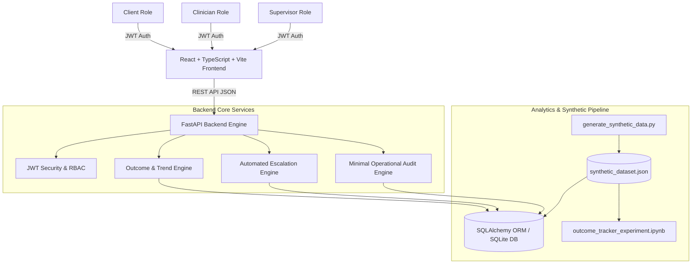

# Architecture & Technical Documentation — Collaborative Outcome Tracker

## 1. Overview
The **Collaborative Outcome Tracker for Post-Discharge Psychiatric Care** is a full-stack, privacy-by-design web application. It shifts post-discharge care evaluation from passive appointment attendance logging to collaborative, evidence-backed, client-defined goal tracking.

---

## 2. System Architecture

---

## 3. Tech Stack Breakdown
- **Frontend**: React 18, TypeScript, Vite, Tailwind CSS, Recharts, Axios, Lucide Icons.
- **Backend Framework**: Python 3.10+, FastAPI, Pydantic V2, SQLAlchemy ORM.
- **Database**: SQLite (`outcome_tracker.db`) for zero-dependency local execution, structured with SQLAlchemy ORM to allow seamless migration to PostgreSQL.
- **Testing**: pytest suite covering backend models, API endpoints, RBAC permissions, and 6 explicit failure modes.
- **Synthetic Data**: Reproducible data generator script (`seed=42`).
