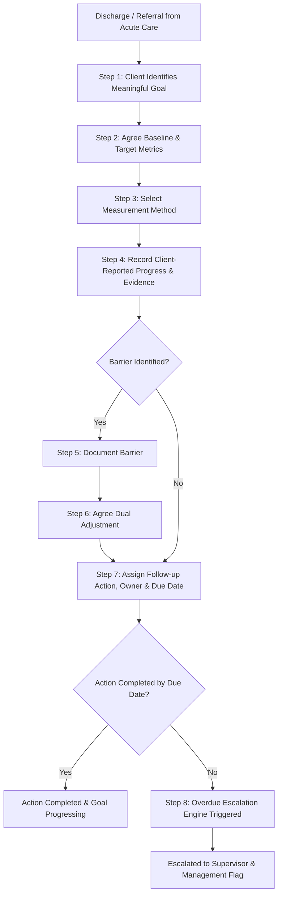

# Field Workflow Map — Collaborative Outcome Tracker

This document describes the 8-stage operational workflow for collaborative goal tracking in post-discharge psychiatric care.

---

## 1. Mermaid Field Workflow Diagram

---

## 2. Detailed Workflow Stages

### Stage 1: Client Goal Identification
During post-discharge planning, the client identifies a meaningful recovery goal in non-diagnostic, functional terms (e.g. "I want to feel confident enough to travel independently on local buses").

### Stage 2 & 3: Baseline, Target & Measurement Method
The care coordinator and client collaboratively specify:
- **Baseline**: Current state (e.g., 0 independent bus journeys/month).
- **Target**: Desired outcome (e.g., 4 independent bus journeys/month).
- **Measurement Method**: Count, frequency, percentage, or rating scale.

### Stage 4: Progress Recording & Evidence
The client or clinician logs progress entries containing numerical values, self-reported confidence scores (1-10), and behavioral evidence notes.

### Stage 5 & 6: Barrier Identification & Dual Agreed Adjustment
If progress stalls, specific barriers are documented (e.g. "Peak-hour travel anxiety"). An adjustment is proposed and requires **dual agreement** (Client + Clinician) to be active.

### Stage 7 & 8: Accountable Action Assignment & Governance Escalation
Every follow-up task is assigned a specific owner role, owner ID, priority level, and hard due date. Overdue high-priority tasks are automatically detected and escalated.
